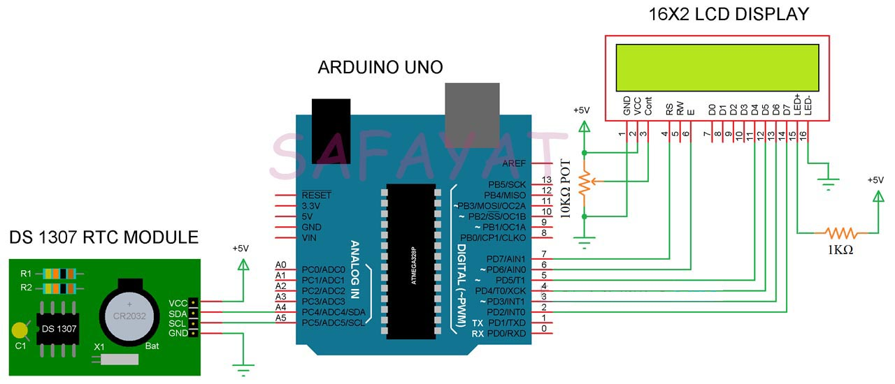

# lcd-based-digital-clock
# Introduction :
Making a micocontroller based Digital Clock and understanding the basic of Real Time Clock module is fun as an engineering student. Real time clock IC’s are present in computers, servers, many embedded systems and in fact they are used wherever it is required to keep an accurate time. 
# DS1307 Real Time Clock :
The DS1307 RTC is a low cost, low power real time clock IC that can maintain full clock and calendar i.e. hours, minutes, seconds as well as year, month and day. 
# Apparatus : 
* Arduino Uno
* DS1307 RTC module 
* Resistors and
* Jumper Wires
# Schematics : 

# Code : 
[Code Link](LCD_Digital_clock.ino)
# Application : 
* With the help of Arduino Real Time Clock interface, we can implement several project related to data logging, alarms, clock, etc.
